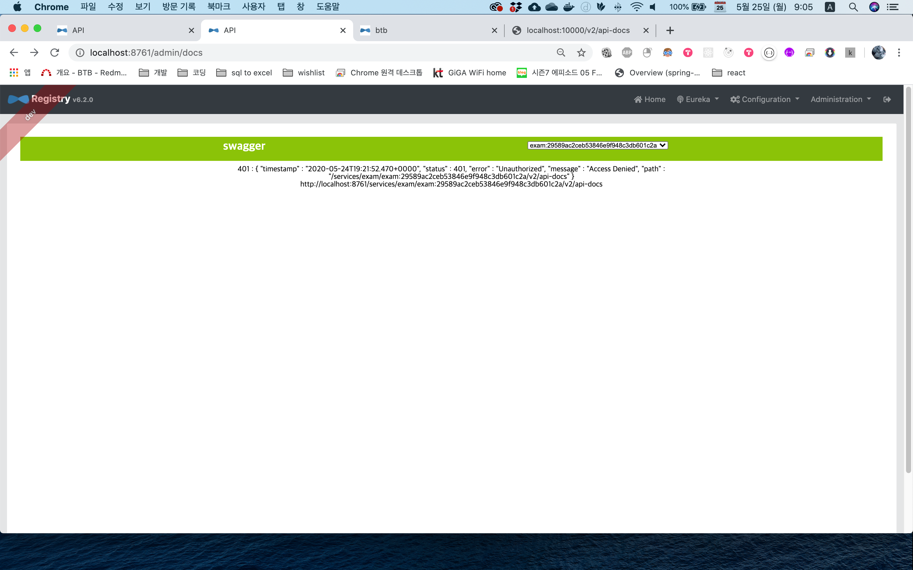
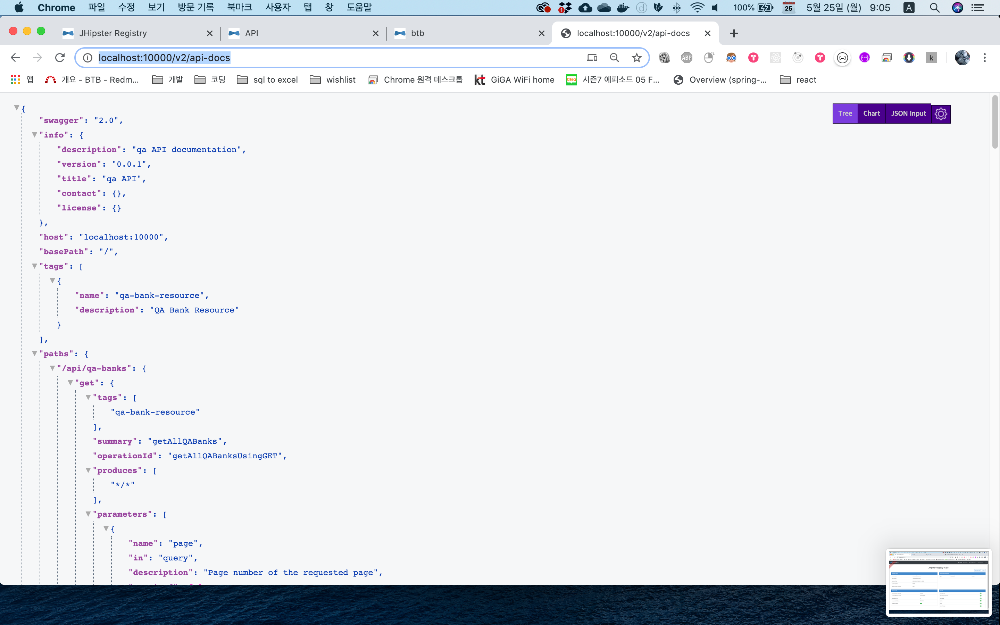

# 1. 실행방법
## 1.1 방법1
- `docker-compose -f exam/src/main/docker/jhipster-registry.yml up`
- `docker-compose -f exam/src/main/docker/redis.yml up`
- intellij 이용 microservice, btb(ui) 실행
## 1.2 방법2
- `docker-compose up` in `/btb_project/result`

# 2. 문제
## 2.1 `vanillaRestTemplate` Bean 존재하지 않는 프로젝트 생성됨
```java
@org.springframework.beans.factory.annotation.Qualifier(value="vanillaRestTemplate")
```

### 2.1.1. 해결
- jhipster 버전 6.8.0 에서 버그 있음 
- 6.9.0 으로 업그레이드 후 실행
- `com.hazelcast.core.HazelcastInstance` Dependency 없음
- 6.7.1 로 다운그레이드
- vanillaRestTemplate bean 없음
- 6.6.0 로 다운그레이드
- 5.8.1 로 다운그레이드
- 6.9.0 으로 업그레이드

## 2.2 discovery 서버 부재
### 2.2.1 해결
- `docker-compose -f src/main/docker/jhipster-registry.yml up`
- [관련 블로그](https://kji6252.github.io/2018/08/11/JHipster-MSA-%EA%B5%AC%EC%B6%95/) 참고
- .png)

## 2.3 hazlecase 불안정
### 2.3.1 해결
- cacheProvider redis 로 변경

## 2.4 swagger document
jhipster-registry(discovery) 에서 microservice 에 접속하면 401 에러로 document 보이지 않는 문제 발생
### 2.4.1 해결중
- microservice 에서 직접 `http://~/v2/api-docs` 로 접속하면 document 보임
- jhipster-registry 에서 document 확인 가능하도록 문제 해결중
- 
- 

# 3. 참고문헌
- [jhipster.tech](https://www.jhipster.tech/)
- [관련 블로그](https://kji6252.github.io/2018/08/11/JHipster-MSA-%EA%B5%AC%EC%B6%95/)